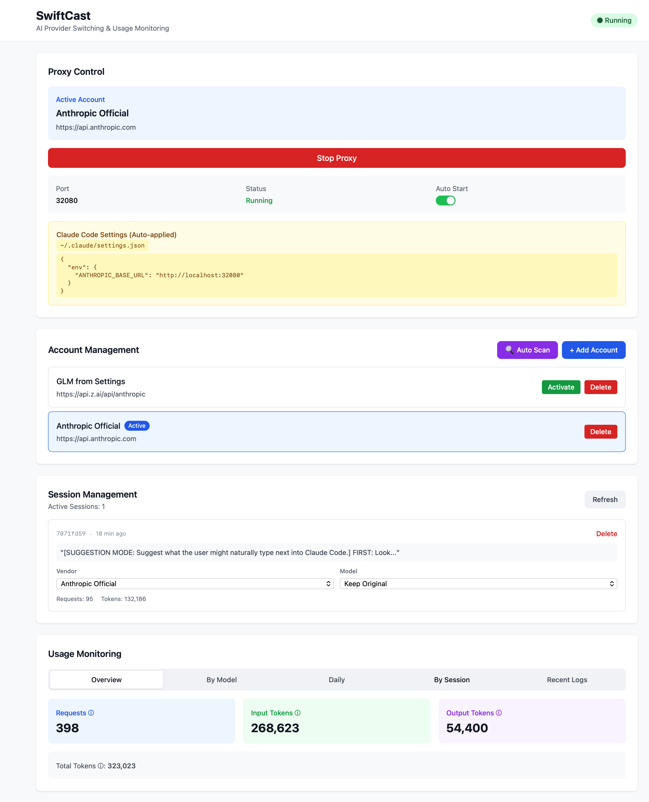
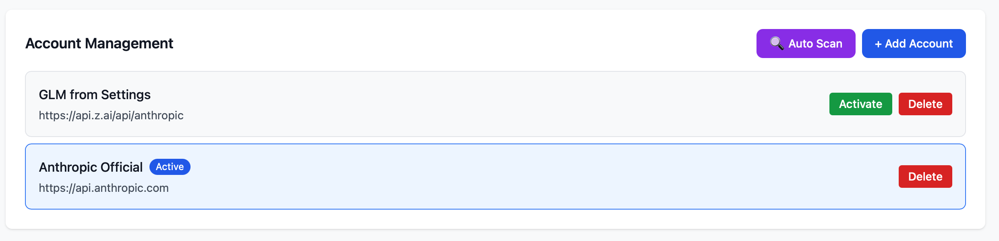
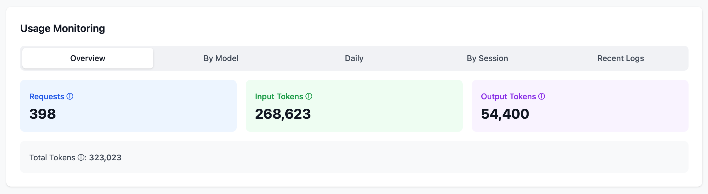
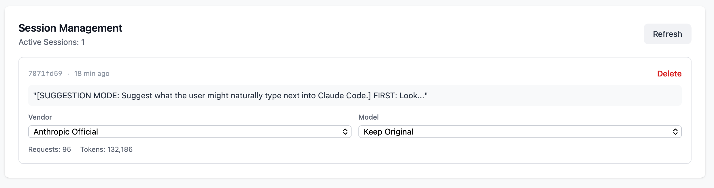
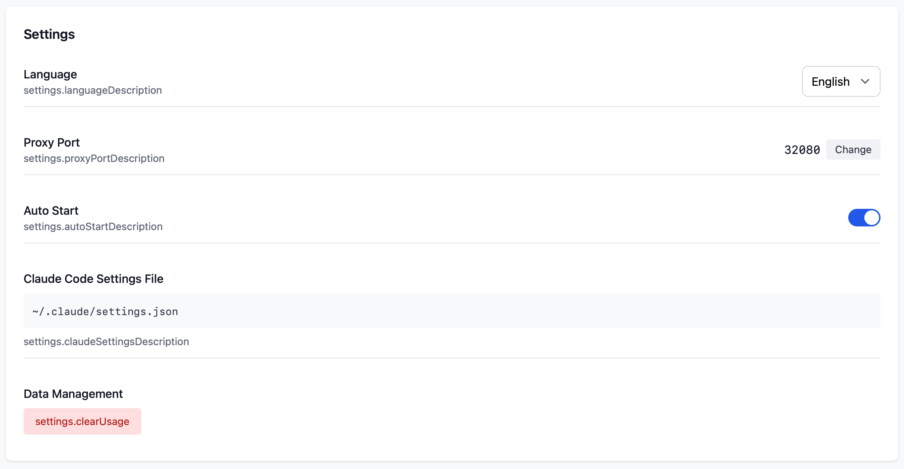

# SwiftCast

**A desktop app for seamlessly switching AI providers and monitoring usage for Claude Code**



## Key Features

- **Provider Switching**: Switch between Anthropic (Claude) and GLM with a single click
- **Usage Monitoring**: Track token usage by session, model, and day
- **Auto Proxy Configuration**: Automatically manages Claude Code's settings.json
- **Auto Scan**: Automatically imports existing Claude credentials from macOS Keychain
- **Session Management**: Run multiple Claude Code instances with different vendors/models

## Installation

### macOS
1. Download the `.dmg` file from [Releases](../../releases)
2. Mount the DMG and drag SwiftCast.app to Applications folder
3. Launch the app

### Build from Source
```bash
# Install dependencies
npm install

# Run in development mode
npm run tauri dev

# Build for release
npm run tauri build
```

Build output:
- `src-tauri/target/release/bundle/macos/SwiftCast.app`
- `src-tauri/target/release/bundle/dmg/SwiftCast_x.x.x_aarch64.dmg`

---

## User Guide

### 1. Account Registration



#### Auto Scan (macOS)
- Click the **Auto Scan** button
- Automatically imports existing Claude credentials from macOS Keychain
- Anthropic Official account will be registered automatically

#### Manual Registration
1. Click **+ Add Account** button
2. Enter account name (e.g., "My GLM Account")
3. Select Base URL:
   - `Anthropic (Claude)`: https://api.anthropic.com
   - `GLM (Z.AI)`: https://api.z.ai/api/anthropic
4. Enter API Key
5. Click **Add** button

### 2. Switching Providers

1. Click **Activate** button on the desired account in the list
2. Proxy automatically switches to that provider
3. Restart Claude Code to use the new provider

### 3. Usage Monitoring



**Overview Tab**:
- Request Count: Number of Claude API calls
- Input Tokens: Tokens used in prompts (system + conversation history + user message)
- Output Tokens: Tokens used in Claude's responses

**Other Tabs**:
- By Model: Usage breakdown by model (claude-sonnet-4, etc)
- Daily: Daily usage for the past 7 days
- By Session: Usage per Claude Code session (per conversation)
- Recent Logs: Individual request records

### 4. Session Management



- Run multiple Claude Code instances simultaneously
- Each session can use a different vendor (Anthropic/GLM) and model
- View last message for easy session identification
- Real-time session activity tracking

### 5. Settings



- **Proxy Port**: Local proxy port for Claude Code connection (default: 32080)
- **Auto Start**: Automatically start proxy when app launches
- **Claude Code Settings File**: Auto-manages `~/.claude/settings.json`
- **Clear Usage Logs**: Delete all usage records

---

## How It Works

```
Claude Code
    ↓ (HTTP Request)
SwiftCast Proxy (localhost:32080)
    ↓ (Check active account)
    ├─→ Anthropic API (OAuth token passthrough)
    └─→ GLM API (uses stored API key)
    ↓ (Log usage - track tokens)
Claude Code
```

### Claude Code Integration

SwiftCast automatically manages `~/.claude/settings.json`:

```json
{
  "env": {
    "ANTHROPIC_BASE_URL": "http://localhost:32080"
  }
}
```

- Proxy start: Creates/updates settings.json
- Proxy stop: Deletes settings.json (Claude Code uses Anthropic API directly)
- Account switch: Auto-updates configuration

---

## Hook System

SwiftCast includes a powerful hook system for intercepting and modifying Claude API traffic.

### Architecture

```
Claude Code
    ↓ API Request
┌─────────────────────────────────────┐
│         SwiftCast Proxy             │
│  ┌───────────────────────────────┐  │
│  │        HookRegistry           │  │
│  │  ┌─────────┐ ┌─────────────┐  │  │
│  │  │Read-Only│ │Modify Hooks │  │  │
│  │  │ Hooks   │ │             │  │  │
│  │  └─────────┘ └─────────────┘  │  │
│  └───────────────────────────────┘  │
└─────────────────────────────────────┘
    ↓ Modified Request
Claude API
```

### Available Hooks

#### 1. FileLoggerHook (Read-Only)

Logs all API requests and responses to JSON files.

**Log Location:** `~/.sessioncast/logs/<session_id>/`

**File Format:**
```
20260128_195442_<request_id>_<seq>_<model>.json
```

**Logged Data:**
- Full request body (messages, system prompt, tools)
- Full response text
- Token usage (input/output)
- Timing information
- Session tracking

**Configuration:**
| DB Key | Default | Description |
|--------|---------|-------------|
| `hooks_enabled` | `true` | Enable/disable all hooks |
| `hooks_retention_days` | `30` | Log retention period |

#### 2. CompactionInjectorHook (Modify)

Injects custom context during Claude Code's conversation compaction.

**Detection Patterns:**
- Summarization request: `"Your task is to create a detailed summary"`
- Compacted conversation: `"This session is being continued from a previous"`

**Configuration:**
| DB Key | Default | Description |
|--------|---------|-------------|
| `compaction_injection_enabled` | `false` | Enable injection |
| `compaction_summarization_instructions` | `""` | Instructions for summary generation |
| `compaction_context_injection` | `""` | Context to inject into compacted conversations |

**Example Usage:**
```sql
-- Enable compaction injection
UPDATE config SET value = 'true'
WHERE key = 'compaction_injection_enabled';

-- Add instructions for summarization
UPDATE config SET value = '- Always include: This project uses Korean language
- Remember to preserve TypeScript strict mode preference'
WHERE key = 'compaction_summarization_instructions';

-- Inject persistent context
UPDATE config SET value = 'Project Rules:
- Respond in Korean
- Use TypeScript strict mode
- Never modify node_modules'
WHERE key = 'compaction_context_injection';
```

### Hook Lifecycle

```
1. Request received
      ↓
2. on_request_before() ────→ Log request start
      ↓
3. modify_request_body() ──→ Inject compaction context
      ↓
4. Forward to Claude API
      ↓
5. Stream response
      ↓
6. on_response_complete() ─→ Log complete response
      ↓
7. on_request_after() ─────→ Finalize logging
```

### Extending Hooks

Create custom hooks by implementing the traits:

```rust
// Read-only hook
#[async_trait]
pub trait Hook: Send + Sync {
    async fn on_request_before(&self, ctx: &RequestContext);
    async fn on_response_complete(&self, req_ctx: &RequestContext, res_ctx: &ResponseContext);
    fn name(&self) -> &'static str;
}

// Modify hook
#[async_trait]
pub trait ModifyHook: Send + Sync {
    async fn modify_request_body(&self, body: &str, ctx: &RequestContext) -> Option<String>;
    fn name(&self) -> &'static str;
}
```

---

## Tech Stack

| Component | Technology |
|-----------|------------|
| Frontend | React + TypeScript + Vite + TailwindCSS |
| Backend | Rust (Tauri 2.x, axum, SQLite) |
| Platform | macOS, Windows (cross-platform) |

### Highlights
- No runtime required (no JRE, Node.js installation needed)
- Small footprint (~10MB, 1/20th of Electron)
- Double-click to run

---

## Project Structure

```
swiftcast/
├── src/                    # Frontend (React)
│   ├── components/
│   │   ├── Dashboard.tsx       # Main dashboard
│   │   ├── AccountManager.tsx  # Account management
│   │   ├── SessionManager.tsx  # Session management
│   │   ├── UsageMonitor.tsx    # Usage monitoring
│   │   └── Settings.tsx        # Settings
│   └── App.tsx
│
├── src-tauri/             # Backend (Rust)
│   ├── src/
│   │   ├── proxy/         # Proxy server (axum + SSE)
│   │   │   ├── hooks/     # Hook system
│   │   │   │   ├── file_logger.rs        # Request/response logging
│   │   │   │   └── compaction_injector.rs # Context injection
│   │   │   ├── webhook.rs       # External webhook support
│   │   │   └── step_tracker.rs  # Tool use tracking
│   │   ├── storage/       # Database (SQLite)
│   │   ├── commands/      # Tauri commands
│   │   └── main.rs
│   └── Cargo.toml
│
└── docs/                  # Screenshots
```

---

## Use Cases

### Scenario 1: Cost Reduction with GLM
1. Register GLM account (Z.AI API Key)
2. Activate GLM for usage
3. Monitor token consumption via usage dashboard

### Scenario 2: Multi-Provider Operation
1. Register both Anthropic and GLM accounts
2. Normal usage: Use primary provider
3. When limit reached: Switch to alternative provider

### Scenario 3: Different Models per Session
1. Run multiple Claude Code instances
2. Assign different models to each session (e.g., Opus for complex tasks, Haiku for simple ones)
3. Monitor usage per session

---

## Development

### Requirements
- Node.js 18+
- Rust 1.70+
- macOS: Xcode Command Line Tools

### Commands
```bash
# Development mode
npm run tauri dev

# Build
npm run tauri build

# Frontend only build
npm run build
```

---

## License

MIT License

## Contributing

Issues and Pull Requests are welcome!
