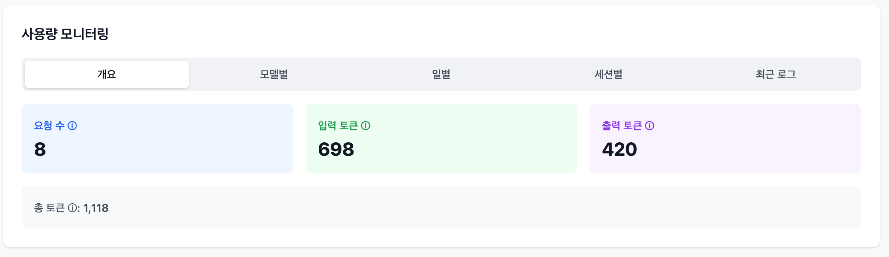
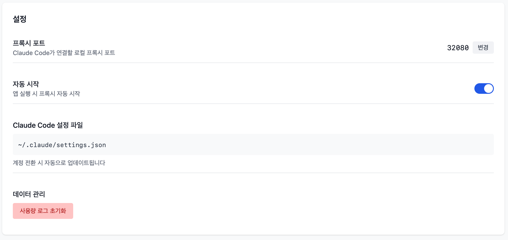

# SwiftCast

**Claude Code의 AI Provider를 자유롭게 스위칭하고 사용량을 모니터링하는 데스크톱 앱**


## 주요 기능

- **Provider 스위칭**: Anthropic (Claude) ↔ GLM 간 한 번의 클릭으로 전환
- **사용량 모니터링**: 토큰 사용량을 세션별/모델별/일별로 추적
- **프록시 자동 설정**: Claude Code의 settings.json을 자동으로 관리
- **Auto Scan**: macOS Keychain에서 기존 Claude 인증 정보 자동 가져오기

## 설치

### macOS
1. [Releases](../../releases)에서 `.dmg` 파일 다운로드
2. DMG 마운트 후 SwiftCast.app을 Applications 폴더로 이동
3. 앱 실행

### 직접 빌드
```bash
# 의존성 설치
npm install

# 개발 모드 실행
npm run tauri dev

# 릴리스 빌드
npm run tauri build
```

빌드 결과물:
- `src-tauri/target/release/bundle/macos/SwiftCast.app`
- `src-tauri/target/release/bundle/dmg/SwiftCast_x.x.x_aarch64.dmg`

---

## 사용자 가이드

### 1. 계정 등록


#### Auto Scan (macOS)
- **Auto Scan** 버튼 클릭
- macOS Keychain에서 기존 Claude 인증 정보를 자동으로 가져옴
- Anthropic Official 계정이 자동 등록됨

#### 수동 등록
1. **+ 계정 추가** 버튼 클릭
2. 계정 이름 입력 (예: "My GLM Account")
3. Base URL 선택:
   - `Anthropic (Claude)`: https://api.anthropic.com
   - `GLM (Z.AI)`: https://api.z.ai/api/anthropic
4. API Key 입력
5. **추가** 버튼 클릭

### 2. Provider 전환

1. 계정 목록에서 사용할 계정의 **활성화** 버튼 클릭
2. 프록시가 자동으로 해당 Provider로 전환됨
3. Claude Code를 재시작하면 새 Provider 사용

### 3. 사용량 모니터링



**개요 탭**:
- 요청 수: Claude API 호출 횟수
- 입력 토큰: 프롬프트에 사용된 토큰 (시스템 + 대화 히스토리 + 사용자 메시지)
- 출력 토큰: Claude 응답에 사용된 토큰

**다른 탭**:
- 모델별: 각 모델(claude-sonnet-4, etc)별 사용량
- 일별: 최근 7일간 일별 사용량
- 세션별: Claude Code 세션별 사용량 (대화 단위)
- 최근 로그: 개별 요청 기록

### 4. 설정



- **프록시 포트**: Claude Code가 연결할 로컬 프록시 포트 (기본: 32080)
- **자동 시작**: 앱 실행 시 프록시 자동 시작
- **Claude Code 설정 파일**: `~/.claude/settings.json` 자동 관리
- **사용량 로그 초기화**: 모든 사용량 기록 삭제

---

## 작동 원리

```
Claude Code
    ↓ (HTTP 요청)
SwiftCast Proxy (localhost:32080)
    ↓ (활성 계정 확인)
    ├─→ Anthropic API (OAuth 토큰 패스스루)
    └─→ GLM API (저장된 API 키 사용)
    ↓ (사용량 기록 - 토큰 추적)
Claude Code
```

### Claude Code 연동

SwiftCast는 `~/.claude/settings.json`을 자동으로 관리합니다:

```json
{
  "env": {
    "ANTHROPIC_BASE_URL": "http://localhost:32080"
  }
}
```

- 프록시 시작 시: settings.json 생성/업데이트
- 프록시 중지 시: settings.json 삭제 (Claude Code가 직접 Anthropic API 사용)
- 계정 전환 시: 자동 업데이트

---

## 기술 스택

| 구분 | 기술 |
|------|------|
| Frontend | React + TypeScript + Vite + TailwindCSS |
| Backend | Rust (Tauri 2.x, axum, SQLite) |
| 플랫폼 | macOS, Windows (크로스 플랫폼) |

### 특징
- 런타임 불필요 (JRE, Node.js 등 설치 불필요)
- 작은 용량 (~10MB, Electron 대비 1/20)
- 더블클릭으로 바로 실행

---

## 프로젝트 구조

```
swiftcast/
├── src/                    # Frontend (React)
│   ├── components/
│   │   ├── Dashboard.tsx       # 메인 대시보드
│   │   ├── AccountManager.tsx  # 계정 관리
│   │   ├── UsageMonitor.tsx    # 사용량 모니터링
│   │   └── Settings.tsx        # 설정
│   └── App.tsx
│
├── src-tauri/             # Backend (Rust)
│   ├── src/
│   │   ├── proxy/         # 프록시 서버 (axum + SSE)
│   │   ├── storage/       # 데이터베이스 (SQLite)
│   │   ├── commands/      # Tauri commands
│   │   └── main.rs
│   └── Cargo.toml
│
└── docs/                  # 스크린샷
```

---

## 사용 시나리오

### 시나리오 1: GLM으로 비용 절감
1. GLM 계정 등록 (Z.AI API Key)
2. GLM 활성화하여 사용
3. 사용량 모니터링으로 토큰 소비 확인

### 시나리오 2: 멀티 Provider 운용
1. Anthropic, GLM 계정 모두 등록
2. 평소: 주력 Provider 사용
3. 한도 도달 시: 다른 Provider로 전환

---

## 개발

### 요구사항
- Node.js 18+
- Rust 1.70+
- macOS: Xcode Command Line Tools

### 명령어
```bash
# 개발 모드
npm run tauri dev

# 빌드
npm run tauri build

# 프론트엔드만 빌드
npm run build
```

---

## 라이선스

MIT License

## 기여

Issues와 Pull Requests를 환영합니다!
