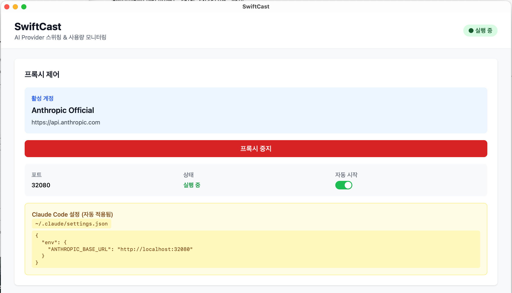

# SwiftCast User Guide

A comprehensive guide to using SwiftCast for AI provider switching and usage monitoring.

## Table of Contents

1. [Getting Started](#getting-started)
2. [Dashboard](#dashboard)
3. [Account Management](#account-management)
4. [Session Management](#session-management)
5. [Usage Monitoring](#usage-monitoring)
6. [Settings](#settings)
7. [Custom Tasks](#custom-tasks)
8. [Hook Configuration](#hook-configuration)
9. [ThreadCast Integration](#threadcast-integration)
10. [Troubleshooting](#troubleshooting)

---

## Getting Started

### Installation

#### macOS
1. Download `SwiftCast_x.x.x_aarch64.dmg` from [Releases](https://github.com/devload/swiftcast/releases)
2. Open the DMG file
3. Drag SwiftCast.app to your Applications folder
4. Launch SwiftCast

#### Windows
1. Download `SwiftCast_x.x.x_x64-setup.exe` from [Releases](https://github.com/devload/swiftcast/releases)
2. Run the installer
3. Follow the installation wizard
4. Launch SwiftCast from Start Menu

### First Launch

When you first launch SwiftCast:
1. The proxy server starts automatically on port 32080
2. Claude Code's `settings.json` is configured automatically
3. You're ready to add your first account!

---

## Dashboard



The Dashboard is your control center for the proxy server.

### Proxy Control

- **Active Account**: Shows the currently active AI provider account
- **Stop/Start Proxy**: Toggle the proxy server on/off
- **Port**: The local port number (default: 32080)
- **Status**: Shows "Running" (green) or "Stopped" (red)
- **Auto Start**: Toggle automatic proxy start on app launch

### Claude Code Settings

The yellow box shows the current Claude Code configuration:
- File path: `~/.claude/settings.json`
- Configuration preview showing `ANTHROPIC_BASE_URL`

---

## Account Management


Manage your AI provider accounts here.

### Auto Scan (macOS only)

Click **Auto Scan** to automatically import Claude credentials from macOS Keychain:
- Finds existing Claude OAuth tokens
- Creates "Anthropic Official" account automatically
- No manual API key entry needed!

### Adding an Account Manually

1. Click **+ Add Account**
2. Fill in the form:
   - **Account Name**: A friendly name (e.g., "My GLM Account")
   - **Base URL**: Select the provider:
     - Anthropic (Claude): `https://api.anthropic.com`
     - GLM (Z.AI): `https://api.z.ai/api/anthropic`
   - **API Key**: Your API key for the selected provider
3. Click **Add**

### Managing Accounts

Each account card shows:
- Account name and base URL
- **Active** badge (blue) for the current account
- **Activate** button to switch to this account
- **Delete** button to remove the account

### Switching Providers

1. Click **Activate** on the desired account
2. The proxy automatically routes to the new provider
3. Your next Claude Code request will use the new provider

---

## Session Management


Manage multiple Claude Code sessions with different configurations.

### What is a Session?

Each Claude Code instance creates a unique session (identified by a trace ID). SwiftCast tracks these sessions and allows you to:
- Assign different vendors to different sessions
- Override models per session
- Monitor usage per session

### Session Card

Each session displays:
- **Session ID**: First 8 characters of the trace ID
- **Time**: How long ago the session was active
- **Last Message**: The most recent user message (helps identify the session)
- **Vendor**: Dropdown to select the AI provider account
- **Model**: Dropdown to override the model (or keep original)
- **Stats**: Request count and token usage

### Changing Session Configuration

1. Find the session you want to modify
2. Select a different **Vendor** from the dropdown
3. Optionally select a **Model** override
4. Changes apply immediately to the next request

### Use Case: Different Models for Different Tasks

- Session A (complex refactoring): Anthropic + Claude Opus 4
- Session B (simple edits): Anthropic + Claude Haiku
- Session C (alternative provider): GLM + GLM-4

---

## Usage Monitoring


Track your API usage across all sessions and providers.

### Overview Tab

Displays aggregate statistics:
- **Requests**: Total number of API calls
- **Input Tokens**: Tokens sent to the API
- **Output Tokens**: Tokens received from the API
- **Total Tokens**: Combined usage

### By Model Tab

Breaks down usage by AI model:
- claude-sonnet-4-20250514
- claude-opus-4-20250514
- claude-3-5-haiku-20241022
- etc.

### Daily Tab

Shows usage trends over the past 7 days:
- Daily request counts
- Daily token consumption
- Helps identify usage patterns

### By Session Tab

Usage breakdown per Claude Code session:
- Useful for project-based tracking
- Compare usage across different tasks

### Recent Logs Tab

Individual request log with:
- Timestamp
- Model used
- Input/output tokens
- Session ID

---

## Settings


Configure SwiftCast behavior.

### Language

Select your preferred language:
- English
- Korean (한국어)
- Japanese (日本語)
- Chinese (中文)

### Proxy Port

Change the local proxy port (default: 32080):
1. Click **Change**
2. Enter new port number
3. Restart Claude Code to use the new port

### Auto Start

Toggle automatic proxy start when SwiftCast launches.

### Claude Code Settings File

Shows the path to the Claude Code configuration file:
- macOS: `~/.claude/settings.json`
- Windows: `%USERPROFILE%\.claude\settings.json`

This file is automatically managed by SwiftCast.

### Data Management

**Clear Usage Logs**: Delete all usage history and statistics.

---

## Troubleshooting

### Claude Code not connecting

1. Check that the proxy is running (green "Running" status)
2. Verify the port number matches
3. Restart Claude Code after changing settings

### "No active account" error

1. Go to Account Management
2. Click **Activate** on an account
3. Or add a new account if none exist

### Auto Scan not finding credentials

Auto Scan only works on macOS and requires:
- Previous Claude Code authentication
- Credentials stored in macOS Keychain

If not found, add accounts manually with your API key.

### High token usage

1. Check Usage Monitoring > By Session
2. Identify which session is consuming tokens
3. Consider using a lighter model for simple tasks

### Session not appearing

Sessions only appear after:
- At least one request through the proxy
- Activity within the last 24 hours

---

## Custom Tasks

Custom Tasks allow you to intercept Claude Code messages and execute custom commands.

### How It Works

When a message **starts with** `>>swiftcast <task_name>`, SwiftCast:
1. Intercepts the request (doesn't send to Claude)
2. Executes the registered task
3. Returns the result as a fake Claude response

### Task Configuration File

Tasks are defined in `~/.sessioncast/tasks.json`:

```json
[
  {
    "name": "build",
    "description": "Build the project",
    "task_type": "shell",
    "command": "npm run build",
    "working_dir": "/path/to/project"
  },
  {
    "name": "status",
    "description": "Check git status",
    "task_type": "shell",
    "command": "git status"
  },
  {
    "name": "register_session",
    "description": "Register session with ThreadCast",
    "task_type": "http",
    "url": "http://localhost:32080/_swiftcast/threadcast/mapping",
    "http_method": "POST"
  }
]
```

### Task Types

| Type | Description | Required Fields |
|------|-------------|-----------------|
| `shell` | Execute shell command | `command` |
| `http` | Make HTTP request | `url`, `http_method` |
| `read_file` | Read file contents | `file_path` |

### Task Definition Fields

| Field | Type | Description |
|-------|------|-------------|
| `name` | string | Task name (used in `>>swiftcast <name>`) |
| `description` | string | Description shown in results |
| `task_type` | string | `shell`, `http`, or `read_file` |
| `command` | string | Shell command to execute |
| `working_dir` | string | Working directory for shell commands |
| `url` | string | HTTP endpoint URL |
| `http_method` | string | `GET` or `POST` |
| `file_path` | string | Path to file to read |
| `env` | object | Environment variables to set |

### Placeholders

Use these placeholders in `command`, `url`, or `file_path`:

| Placeholder | Description |
|-------------|-------------|
| `{session_id}` | Current Claude session ID |
| `{path}` | Request path |
| `{model}` | Model being used |
| `{args}` | Arguments passed to the task |

### Environment Variables

Shell tasks automatically receive these environment variables:

| Variable | Description |
|----------|-------------|
| `SWIFTCAST_SESSION_ID` | Current session ID |
| `SWIFTCAST_PATH` | Request path |
| `SWIFTCAST_MODEL` | Model name |
| `SWIFTCAST_ARGS` | Task arguments |

### Usage Examples

```
# List all available tasks
>>swiftcast list

# Reload tasks from config file
>>swiftcast reload

# Run a task
>>swiftcast build

# Run a task with arguments
>>swiftcast deploy --env=production

# Register session with ThreadCast
>>swiftcast register_session --todo-id=123
```

### Detection Rules

| Message | Triggers? |
|---------|-----------|
| `>>swiftcast build` | ✅ Yes |
| `  >>swiftcast build` | ✅ Yes (leading whitespace OK) |
| `Please >>swiftcast build` | ❌ No (not at start) |
| `run >>swiftcast build` | ❌ No (not at start) |

---

## Hook Configuration

Hooks allow you to customize SwiftCast behavior per-session or system-wide.

### System-Wide Hooks

Configure in SwiftCast Settings:

| Setting | Default | Description |
|---------|---------|-------------|
| Hooks Enabled | `true` | Enable/disable all hooks |
| Retention Days | `30` | Days to keep hook logs |
| Compaction Injection | `false` | Inject context into compaction requests |

### Session-Level Hooks

Override system settings for specific sessions via API:

```bash
# Set session hooks
curl -X POST http://localhost:32080/_swiftcast/session-hooks \
  -H "Content-Type: application/json" \
  -d '{
    "session_id": "abc123...",
    "api_logging_enabled": true,
    "compaction_injection_enabled": false,
    "custom_tasks_enabled": true
  }'

# Get session hooks
curl http://localhost:32080/_swiftcast/session-hooks/abc123...

# Delete session hooks (revert to system defaults)
curl -X DELETE http://localhost:32080/_swiftcast/session-hooks/abc123...
```

### Hook Settings

| Setting | Type | Default | Description |
|---------|------|---------|-------------|
| `api_logging_enabled` | bool | `true` | Log API requests/responses |
| `compaction_injection_enabled` | bool | `false` | Inject context into compaction |
| `compaction_summarization_instructions` | string | `""` | Custom summarization instructions |
| `compaction_context_injection` | string | `""` | Context to inject |
| `custom_tasks_enabled` | bool | `true` | Allow `>>swiftcast` commands |

### Use Cases

**Disable logging for sensitive sessions:**
```json
{
  "session_id": "sensitive-session",
  "api_logging_enabled": false
}
```

**Enable compaction injection for specific project:**
```json
{
  "session_id": "project-session",
  "compaction_injection_enabled": true,
  "compaction_context_injection": "Always use TypeScript strict mode"
}
```

**Disable custom tasks for production:**
```json
{
  "session_id": "prod-session",
  "custom_tasks_enabled": false
}
```

---

## ThreadCast Integration

SwiftCast integrates with ThreadCast for session-to-task mapping.

### Session Mapping

Register a session with a ThreadCast todo:

```bash
# Direct format
curl -X POST http://localhost:32080/_swiftcast/threadcast/mapping \
  -H "Content-Type: application/json" \
  -d '{
    "session_id": "abc123...",
    "todo_id": "todo-456"
  }'

# Args format (from custom task)
curl -X POST http://localhost:32080/_swiftcast/threadcast/mapping \
  -H "Content-Type: application/json" \
  -d '{
    "session_id": "abc123...",
    "args": "--todo-id=todo-456"
  }'
```

### Webhook Events

When ThreadCast webhook is enabled, SwiftCast sends events:

| Event | Trigger | Data |
|-------|---------|------|
| `session_complete` | `stop_reason: "end_turn"` | session_id, todo_id, tokens |
| `step_progress` | Tool use detected | step info, status |
| `ai_question` | AI asks question | question, options |

### Webhook Configuration

Configure in SwiftCast Settings:
- **Webhook URL**: `http://localhost:21000` (default)
- **Webhook Enabled**: Toggle on/off

---

## Tips & Best Practices

### Cost Optimization

1. Use **Session Management** to assign cheaper models to simple tasks
2. Monitor **Daily** usage to track spending trends
3. Use GLM as a fallback when Claude limits are reached

### Multi-Provider Setup

1. Register both Anthropic and GLM accounts
2. Keep one as primary, one as backup
3. Switch instantly when hitting rate limits

### Privacy

- API keys are stored locally in encrypted storage
- No data is sent to external servers (except your chosen AI provider)
- All traffic goes through your local machine

---

## Keyboard Shortcuts

| Action | macOS | Windows |
|--------|-------|---------|
| Show/Hide Window | Click tray icon | Click tray icon |
| Quit App | Tray > Quit | Tray > Quit |

---

## Getting Help

- **GitHub Issues**: [Report bugs or request features](https://github.com/devload/swiftcast/issues)
- **Releases**: [Download latest version](https://github.com/devload/swiftcast/releases)

---

*SwiftCast is open source under the MIT License.*
